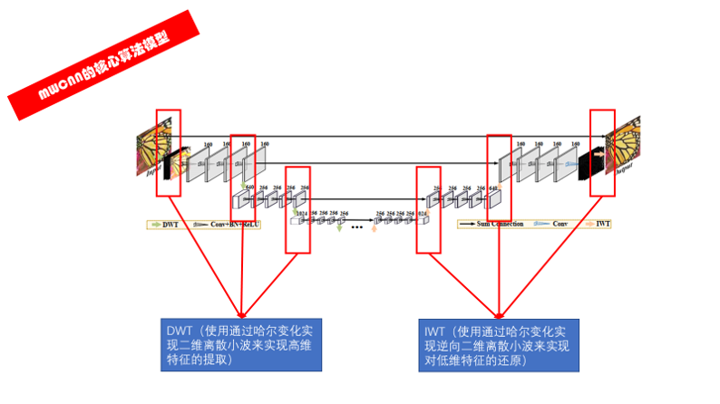
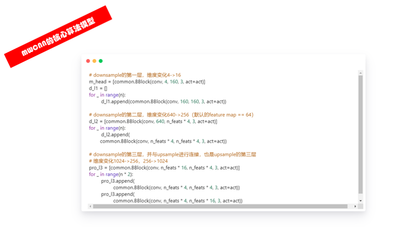
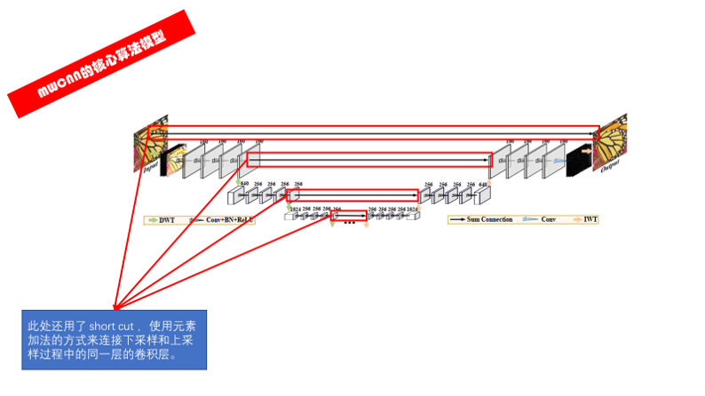
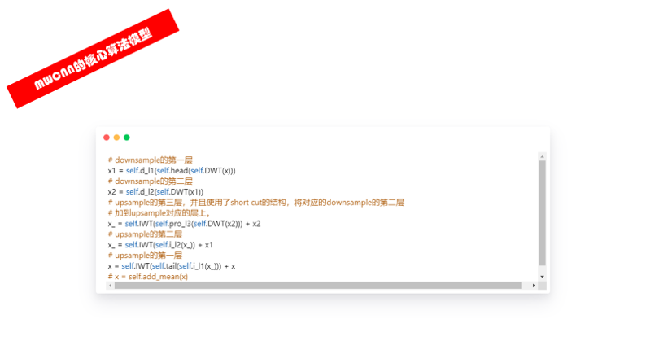

<!--
 * @Description:
 * @Author: fangn
 * @Github:
 * @Date: 2019-11-18 10:23:32
 * @LastEditors: fangn
 * @LastEditTime: 2019-11-19 14:25:09
 -->

# MWCNN_PyTorch

## 论文地址
https://arxiv.org/abs/1805.07071

## 参考代码
- [lpj0/MWCNN_PyTorch](https://github.com/lpj0/MWCNN_PyTorch)

## 参考资料：

- [论文阅读笔记之——《Multi-level Wavelet-CNN for Image Restoration》及基于pytorch的复现](https://blog.csdn.net/gwplovekimi/article/details/84851871)
- [[Python ]小波变化库——Pywalvets 学习笔记](https://blog.csdn.net/nanbei2463776506/article/details/64124841)
- [PyWavelets : 2D Forward and Inverse Discrete Wavelet Transform](https://pywavelets.readthedocs.io/en/latest/ref/2d-dwt-and-idwt.html#single-level-dwt2)

## 说明

### DWT（代替下采样） 和 IWT （代替上采样） 

### UNet 结构每一层下采样（DWT）或上采样（IWT）之后的卷积单元

### DWT/IWT 和 卷积单元的核心代码

### 跳接线机制

### 跳接线机制的核心代码

